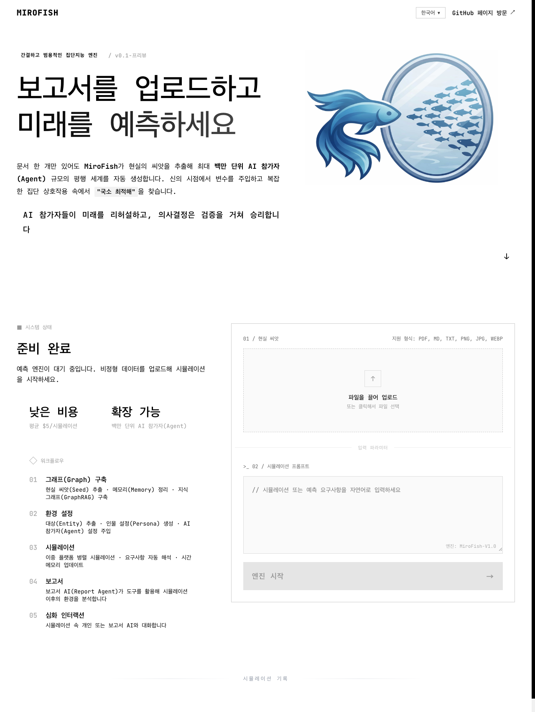

<div align="center">


# MiroFish-localized

**한국어 우선 · 로컬 Compose 우선 · Graphiti/Neo4j 기반 집단지능 시뮬레이션 실험대**

[한국어 README](./README.md) · [원본 중국어 README](./README-ZH.md) · [로컬 빠른 시작](./docs/local-quickstart-ko.md) · [문서 허브](./docs/README.md)

</div>

---

## ✅ 현재 상태

이 저장소는 원본 MiroFish를 그대로 번역만 해둔 버전이 아니라, **Mac 로컬 런타임에서 한국어로 연구/시뮬레이션/E2E 검증을 돌리기 위한 localized fork**입니다.

현재 main/develop 기준으로 반영된 핵심은 다음입니다.

| 영역 | 현재 상태 |
|---|---|
| 기본 실행 | Docker Compose-first 로컬 실행 |
| 그래프 메모리 | `GRAPH_PROVIDER=graphiti` 기본, Graphiti + Neo4j 경로 |
| fallback 정책 | Graphiti 실패를 `local_simple`로 조용히 숨기지 않고 fail-closed |
| 한국어 UX | 홈/업로드/시뮬레이션/Report Agent 중심 한국어 UI 기준선 |
| 멀티모달 입력 | TXT/MD/PDF + 이미지/차트/PDF 내부 시각자료 분석 경로 |
| Persona 범위 | Core-vs-All scope 표시, 기본 Core 선택/긴 실행 경고 정책 |
| Simulation 기본값 | Graph memory update ON, 기본 짧은 실행 24 rounds |
| Multiverse | 단일 실행 위에 여러 universe child simulation을 얹는 ensemble MVP |
| Report Agent | 단일/멀티버스 결과를 문맥으로 읽고 질문/비교/추천 질문 제공 |
| BettaFish 연동 | BettaFish 최종 Markdown 보고서를 MiroFish seed로 넣는 resume-safe runner |
| 운영 문서 | 한국어 canonical docs + 에이전트별 문서 갱신 기준 추가 |

---

## 🖼️ 현재 한국어 화면

아래 이미지는 현재 localized UI에서 직접 캡처한 화면입니다. 원본 README의 중국어 데모 스크린샷을 그대로 재사용하지 않습니다.



확인되는 요소:

- 한국어 언어 선택 상태
- 보고서/파일 업로드 중심 시작 흐름
- Step1~Step5 워크플로우
- Report Agent, GraphRAG, Agent/Persona 용어의 한국어-first 표기

---

## 🧭 제품 흐름

```text
1. 현실 씨앗 업로드
   PDF/MD/TXT/이미지/차트/PDF 내부 시각자료 입력

2. 분류 구조(Ontology) / 그래프(GraphRAG) 구축
   Graphiti/Neo4j에 Entity/관계/사실을 저장

3. Persona / Agent 생성
   Core scope 또는 All scope 선택 후 시뮬레이션 참가자 구성

4. Simulation 실행
   기본 Graph memory update ON, 기본 짧은 실행 24 rounds

5. Report Agent
   시뮬레이션 결과/증거/멀티버스 비교를 읽고 한국어 Q&A
```

---

## 🌌 Multiverse / Ensemble 상태

MiroFish-localized는 단일 simulation 경로를 보존하면서 그 위에 **멀티버스(ensemble) 계층**을 추가했습니다.

```text
MultiverseExperiment (mv_*)
  └─ UniverseChild[]
       └─ 기존 SimulationManager child simulation (sim_*)
```

현재 지원:

- 여러 universe child simulation 생성
- scenario/persona variation 저장
- prepare/start queue와 `max_parallel` 실행 슬롯
- outcome cluster / sensitivity axes / `ensemble_frequency` 비교
- Report Agent가 읽을 수 있는 multiverse context
- RWA/시장 주제용 bounded-real backend evaluation runner
- live-local-runtime canary preflight: LLM/embedding/Graphiti endpoint 확인 후 fail-closed

주의: `ensemble_frequency`는 실제 확률 예측이 아니라 **동일 조건 하위 universe 중 몇 개가 비슷한 결과로 묶였는지**를 나타내는 비교 지표입니다.

---

## 🐟 BettaFish 보고서 → MiroFish 단일 시뮬레이션

BettaFish가 만든 최종 Markdown 보고서를 현실 seed로 사용해 MiroFish graph → simulation → report → Report Agent QA까지 이어갈 수 있습니다.

```bash
python -u scripts/bettafish-single-e2e-runner.py \
  --bettafish-report /path/to/final_report.md \
  --topic "스페이스X 상장과 함께 볼 투자 테마" \
  --state-path .hermes/runs/bettafish-mirofish-single-e2e/state.json \
  --log-file .hermes/runs/bettafish-mirofish-single-e2e/events.jsonl
```

runner 특징:

- `project_id`, `graph_task_id`, `graph_id`, `simulation_id`, `report_task_id`, `report_id` 저장
- SIGTERM/timeout 이후 같은 state file로 resume
- stdout + JSONL event flush
- graph/prepare/action/report/chat timeout 분리
- 실패한 attempt와 성공한 resume run을 하나의 summary로 통합

---

## 🚀 로컬 실행

현재 이 Mac의 기준 경로:

```bash
cd /Volumes/ExternalSSD/Workspace/Projects/mirofish-localized
```

기본 실행:

```bash
cp .env.example .env
# .env에서 LLM/embedding/multimodal endpoint 확인
docker compose up -d --build
```

기본 URL:

```text
Frontend: http://127.0.0.1:3000/
Backend:  http://127.0.0.1:5001/health
Graphiti: http://127.0.0.1:8000/healthcheck
Neo4j:    http://127.0.0.1:7474/
```

자세한 한국어 실행 문서:

- [로컬 빠른 시작](./docs/local-quickstart-ko.md)
- [Architecture](./docs/current/architecture.md)
- [QA 기준](./docs/current/qa.md)
- [Release 기준](./docs/current/release.md)
- [Branch / PR / CI 운영 기준](./docs/current/branch-flow.md)

---

## 🧪 검증 명령

기본 게이트:

```bash
npm run build
cd backend && uv run pytest -q
cd ..
docker compose config --quiet
```

로컬 smoke:

```bash
./scripts/local-smoke.sh
GRAPHITI_NATIVE_ONLY_SMOKE=1 ./scripts/graphiti-native-smoke.py
```

멀티버스 focused test:

```bash
cd backend
uv run pytest tests/test_multiverse_manager.py tests/test_multiverse_orchestration.py tests/test_multiverse_advanced_orchestration.py tests/test_route_smoke.py -q
```

멀티버스 bounded/live canary runner:

```bash
python scripts/multiverse-long-run-eval.py \
  --mode bounded \
  --topic "RWA 실물자산 토큰화 시장 반응" \
  --universe-count 5 \
  --rounds 24 \
  --clustering-strategy semantic

python scripts/multiverse-long-run-eval.py \
  --mode live \
  --topic "RWA 실물자산 토큰화 시장 반응"
```

---

## 🧑‍💻 에이전트 문서 운영 원칙

이 프로젝트는 Hermes 에이전트들이 기능 구현뿐 아니라 문서도 함께 유지합니다.

문서 에이전트/작업자는 다음을 지켜야 합니다.

1. 기능 변경이 있으면 README와 `docs/current/*`의 현재 상태를 함께 갱신합니다.
2. 사용자-facing 변경은 한국어-first로 설명하고, 필요한 경우 영어 원어를 괄호로 병기합니다.
3. 원본 MiroFish 중국어 스크린샷을 current evidence처럼 재사용하지 않습니다.
4. UI 변경이 있으면 실제 로컬/Pages 화면 캡처 또는 canary artifact를 남깁니다.
5. 실패한 runner/중단된 background process와 최종 성공 resume을 문서에서 구분합니다.
6. Pages는 전체 runtime이 아니라 정적 checkpoint임을 명확히 씁니다.
7. `.hermes/runs/*`는 로컬 실행 증거이고, canonical docs에는 결론/사용법/현재 상태만 정리합니다.

상세 기준: [docs/README.md](./docs/README.md)

---

## 📄 원본과 라이선스

이 저장소는 원본 MiroFish를 기반으로 한 localized fork입니다.

- 원본 README/중국어 문서는 [README-ZH.md](./README-ZH.md)에 보존합니다.
- 이 fork의 기본 README는 현재 localized runtime 상태를 한국어로 설명합니다.
- 라이선스: AGPL-3.0
